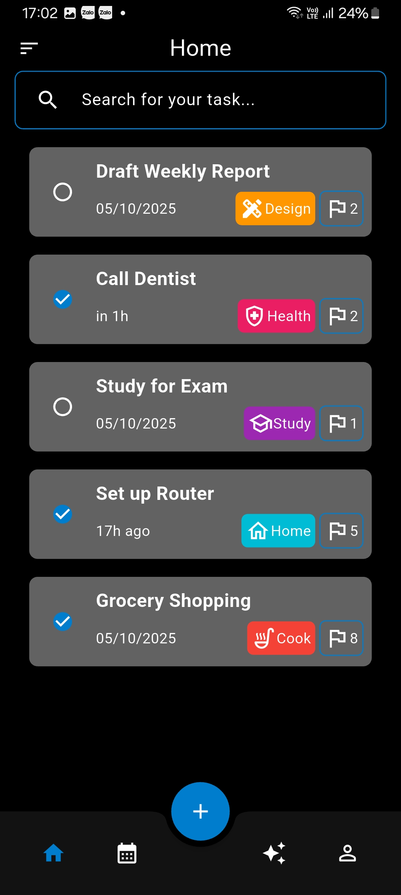
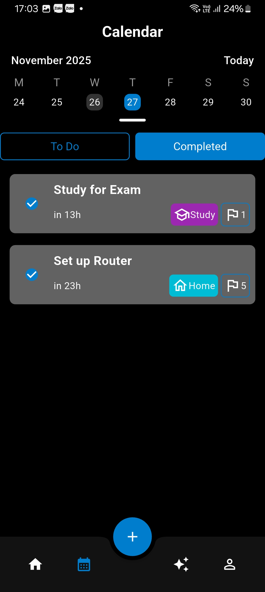
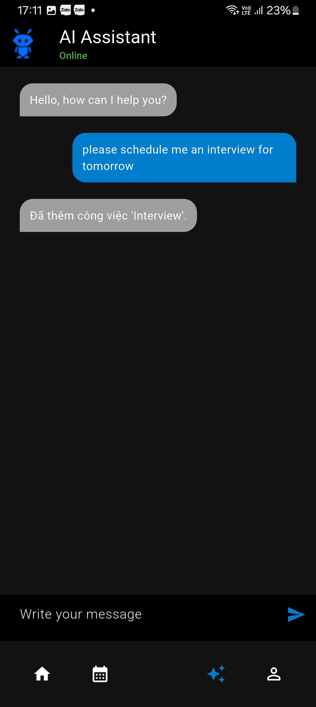
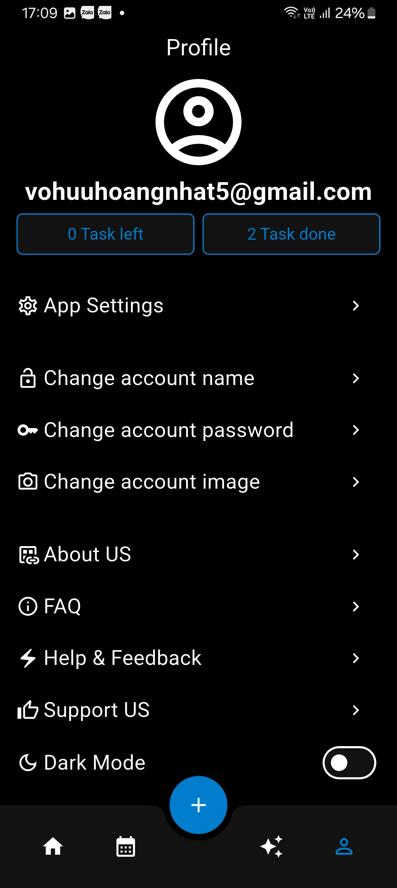
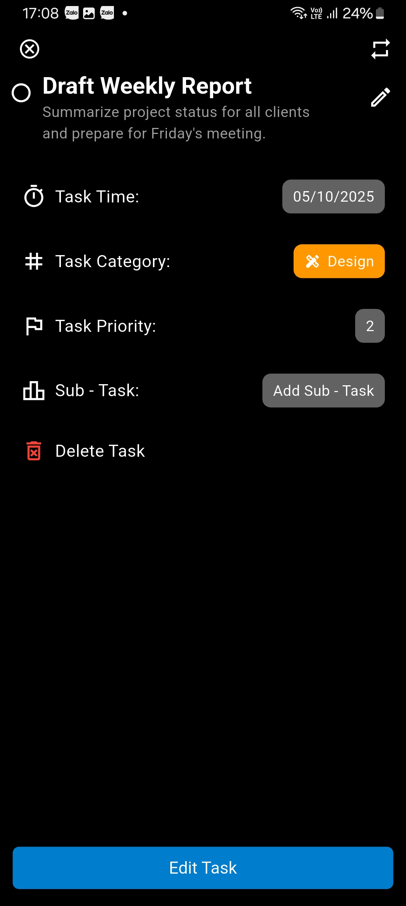

# mytodoapp

# 📝 Flutter Todo App (Clean Architecture)

A modern, intuitive, and feature-rich Task Management application built with **Flutter**. This project demonstrates the implementation of **Clean Architecture** principles to ensure scalability, testability, and maintainability.

## 📸 Screenshots

| Home Screen | Scheduled task | Ai assistant| Profile | Task Detail | Edit Task |
|:---:|:---:|:---:|
|  |  |  |  |   |  | 

## ✨ Features

* **Task Management**: Create, Read, Update, and Delete (CRUD) tasks efficiently.
* **Smart Organization**:
    * 📅 **Calendar Integration**: Pick specific dates and times for deadlines.
    * 🏷️ **Categories**: Organize tasks by categories (Work, Personal, etc.) with custom colors and icons.
    * 🚩 **Priority System**: Set priorities (High, Medium, Low) to focus on what matters.
* **Sub-tasks**: Break down complex tasks into smaller, manageable sub-tasks.
* **Clean UI**: Custom built components (like `TaskComponent`) following Material Design 3 guidelines.
* **Theme Support**: Dark and Light mode support (adaptive color schemes).

## 🛠️ Tech Stack & Architecture

This project is built using **Clean Architecture** to separate concerns:

* **📝 Task Management**: Create, edit, delete, and organize tasks with categories and priorities.
* **🧠 AI Assistant**: Smart suggestions or chat interface to help manage your workload (implied by `assistant` module).
* **📅 Calendar View**: Visualize tasks and deadlines on a calendar interface.
* **🔔 Notifications**: Local notifications to remind you of upcoming deadlines.
* **🔐 Authentication**: Secure user login and registration system.

### Key Packages
* **State Management**: `flutter_bloc`
* **Dependency Injection**: `get_it` 
* **Storage**:  `Firebase` / `SharedPreferences` .

## 📂 Project Structure

```
lib/
├── common/             # Shared resources
│   ├── bloc/           # Global or shared BLoCs
│   ├── helper/         # Utility functions
│   └── widgets/        # Reusable UI components
├── core/               # Core configurations & Base UseCases
│   ├── config/         # App routes, themes, constants
│   └── usecase/        # Base UseCase class
├── data/               # DATA LAYER
│   ├── assistant/      # AI Assistant data logic
│   ├── auth/           # Authentication repositories & sources
│   ├── notify/         # Notification services
│   └── task/           # Task CRUD operations & models
├── domain/             # DOMAIN LAYER (Business Logic)
│   ├── assistant/      # Entities & UseCases for Assistant
│   ├── auth/           # Entities & UseCases for Auth
│   ├── notify/         # Entities & UseCases for Notify
│   └── task/           # Entities & UseCases for Task
├── presentation/       # PRESENTATION LAYER (UI)
│   ├── assistant/      # Chat/Assistant screens
│   ├── auth/           # Login/Signup screens
│   ├── scheduled/      # Scheduled task screen
│   ├── edit/           # Edit Task screen
│   ├── home/           # Main Dashboard
│   ├── profile/        # User Profile
│   └── splash/         # Splash screen
└── main.dart           # App Entry point